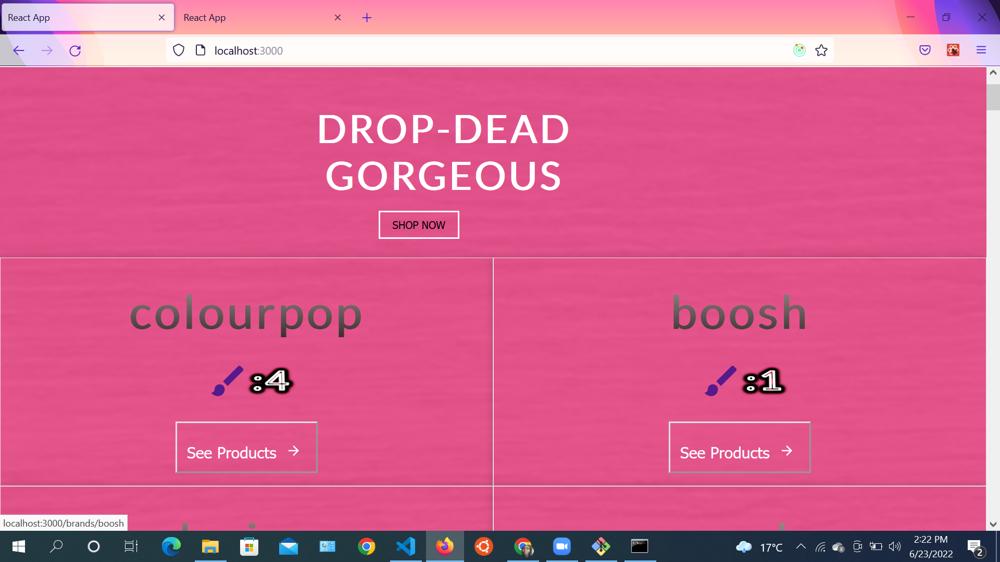
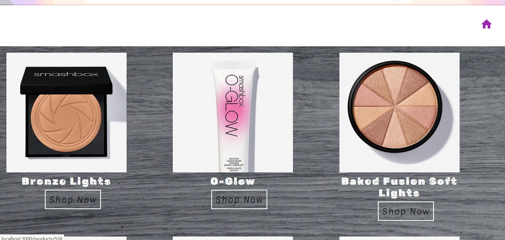
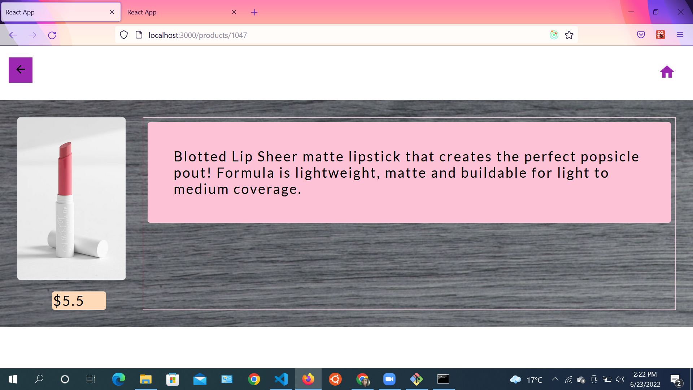

[](https://app.netlify.com/sites/app-pokemon-webapp/deploys)

# Beauty Parlour App

This app extracts data Makeup API and displays a list of different brands, products contained in the brand and product details.

## _Microverse React Capstone Project_

> This educational project is to build a mobile web application to check a list of metrics (numeric values) using React and Redux.
> An API is selected that provides numeric data about a topic and then build the web app around it. The web app will have several pages:
>
> - a home page with a list of items that could be filtered by some parameters.
> - another page for the item details

## Learning Objectives 🔖

- [x] Use React documentation.
- [x] Use React components.
- [x] Use React props.
- [x] Use React Router.
- [x] Connect React and Redux.
- [x] Handle events in a React app.
- [x] Write integration tests with a React testing library.
- [x] Use styles in a React app.
- [x] Use React life cycle methods.
- [x] Apply React best practices and language style guides in code.
- [x] Use store, actions and reducers in React.

## Project Documentation 📄

- [x] Here is the presentation video [link](https://drive.google.com/file/d/1TOnf7yuGItQzSfxj6WnMh_dTBKG_8qoI/view?usp=sharing)👈

## Built With 🛠️

- [x] Languages: HTML, Sass and JavaScript
- [x] Linters: Stylelint and ESLint
- [x] Front-end library: React with Redux Toolkit
- [x] API:
- [x] Code Editor: VS Code

## Screenshots 📸





## Live Demo 🔗

Check the live demo [netlify](https://beauty-parlour-kwambiee.netlify.app/)👈
check video presentation[Video Presentation](https://www.loom.com/share/7af0fdd2de654b2a89d116e21f81b29e)

## Getting Started

To get a local copy up and running follow these simple steps.

### Prerequisites

- [x] A web browser like Google Chrome.
- [x] A code editor like Visual Studio Code with Git and Node.js.

You can check if Git is installed by running the following command in the terminal.

```
$ git --version
```

Likewise for Node.js and npm for package installation.

```
$ node --version && npm --version
```

### Setup

Clone the repository using the GitHub link provided below.

### Install

In the terminal, go to your file directory and run this command.

```
$ git clone git@github.com:kwambiee/beauty-parlour.git
```

### Usage

Kindly modify the files as needed.

### Run tests

To check for linters, use the files provided by [Microverse](https://github.com/microverseinc/linters-config). A GitHub action is also set to run during pull request.

```
$ npm install
```

### Deployment

This app is deployed in the GitHub Pages for easy viewing upon merged on the main branch.
Please find the link in the Live Demo section.

## Author

👤 **Joy Kwamboka** 

- LinkedIn: [](https://www.linkedin.com/in/joy-kwamboka/)

- AngelList: [](https://angel.co/u/joy-kwamboka)

- GitHub: [](https://github.com/kwambiee)

- Twitter: [](https://twitter.com/kwambiee)

- Gmail: [](mailto:kwambokaj2.jk@gmail.com)

## 🤝 Contributing

Contributions, issues, and feature requests are welcome!

Feel free to check the [issues page](https://github.com/mavericks-db/capstone03/issues).

## Show your support

Give a ⭐️ if you like this project!

## Acknowledgments

- [Microverse](https://www.microverse.org/)
- Code Reviewers

## 📝 License

This project is [MIT](./MIT.md) licensed.
